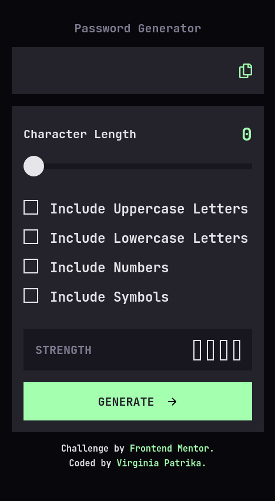
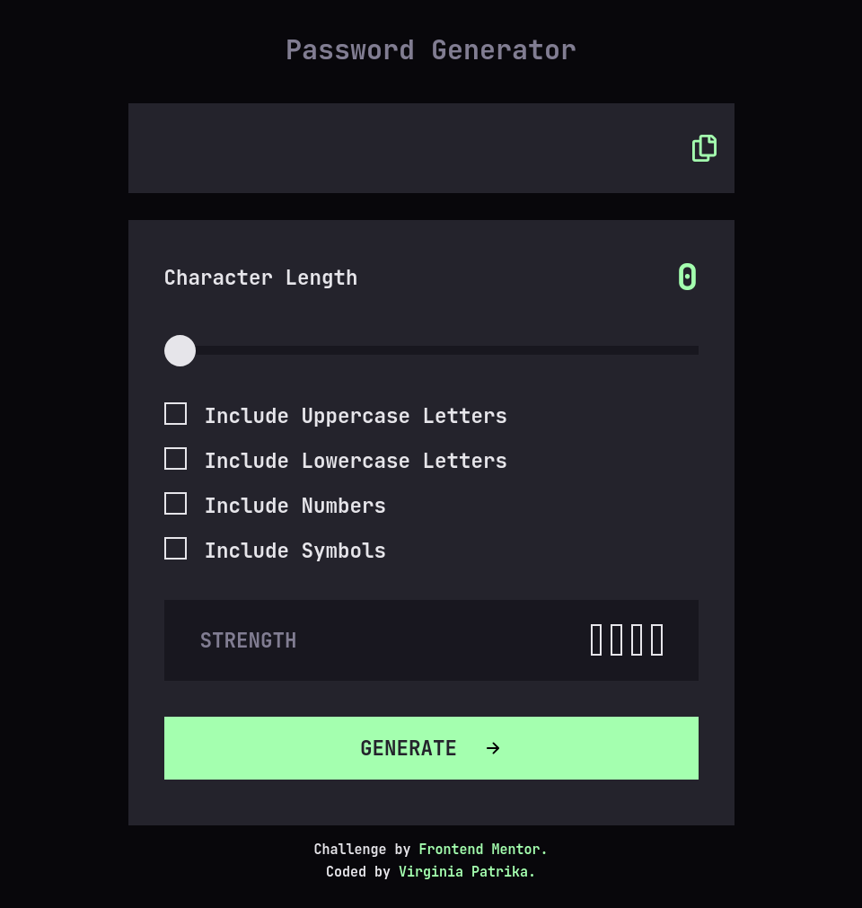

# Frontend Mentor - Password generator app solution

This is a solution to the [Password generator app challenge on Frontend Mentor](https://www.frontendmentor.io/challenges/password-generator-app-Mr8CLycqjh). Frontend Mentor challenges help you improve your coding skills by building realistic projects.

## Table of contents

- [Overview](#overview)
  - [The challenge](#the-challenge)
  - [Screenshot](#screenshot)
  - [Links](#links)
- [My process](#my-process)
  - [Built with](#built-with)
- [Author](#author)

## Overview

### The challenge

Users should be able to:

- Generate a password based on the selected inclusion options
- Copy the generated password to the computer's clipboard
- See a strength rating for their generated password
- View the optimal layout for the interface depending on their device's screen size
- See hover and focus states for all interactive elements on the page

### Screenshot

### Links

- Solution URL: [GitHub](https://github.com/VirginiaPat/password-generator-app.git)
- Live Site URL: [Netlify](https://password-generator-virgi.netlify.app/)

## My process

### Built with

- Semantic HTML5 markup
- Accesibility
- Tailwind
- Flexbox
- CSS Grid
- Mobile-first workflow
- Javascript

## Author

- Frontend Mentor - [@VirginiaPat](https://www.frontendmentor.io/profile/VirginiaPat)
- GitHub - [VirginiaPat ](https://github.com/VirginiaPat)
- Netlify - [VirginiaPat](https://app.netlify.com/teams/virginia-patrika/sites)
